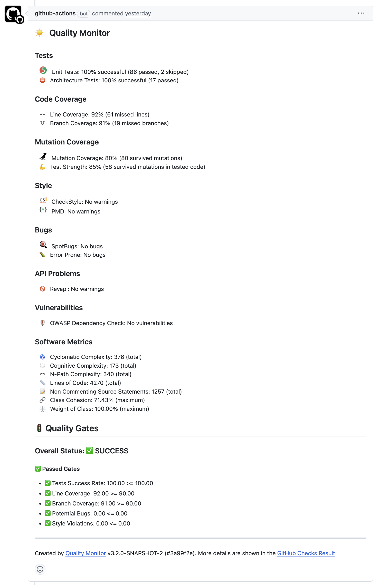
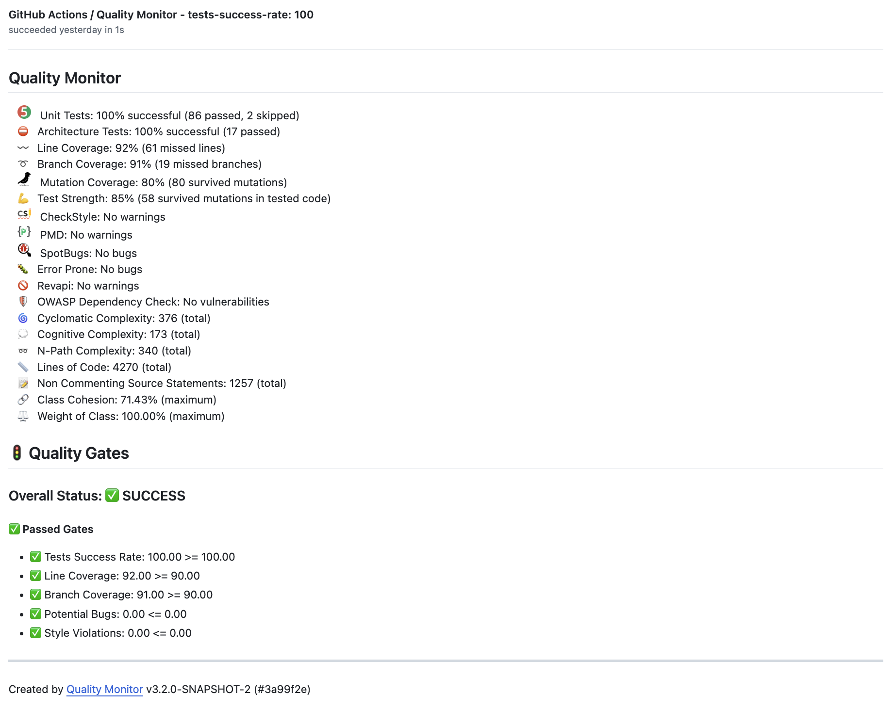
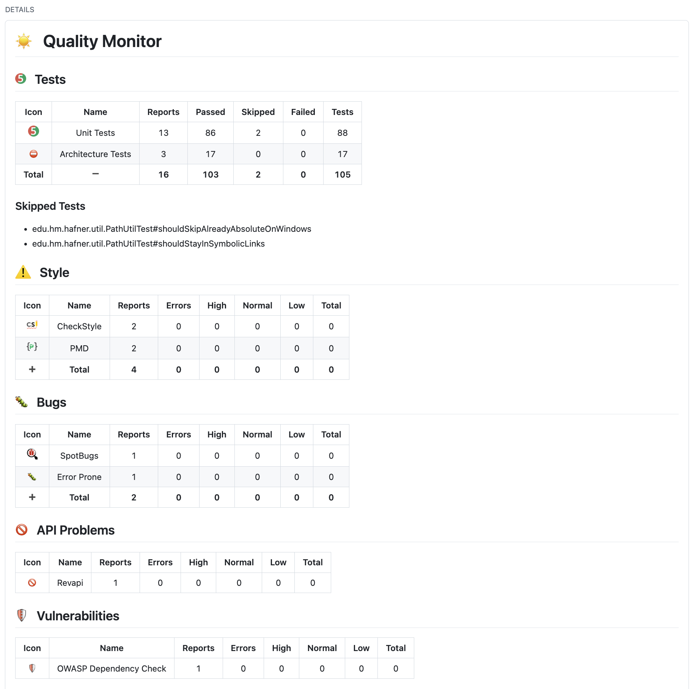
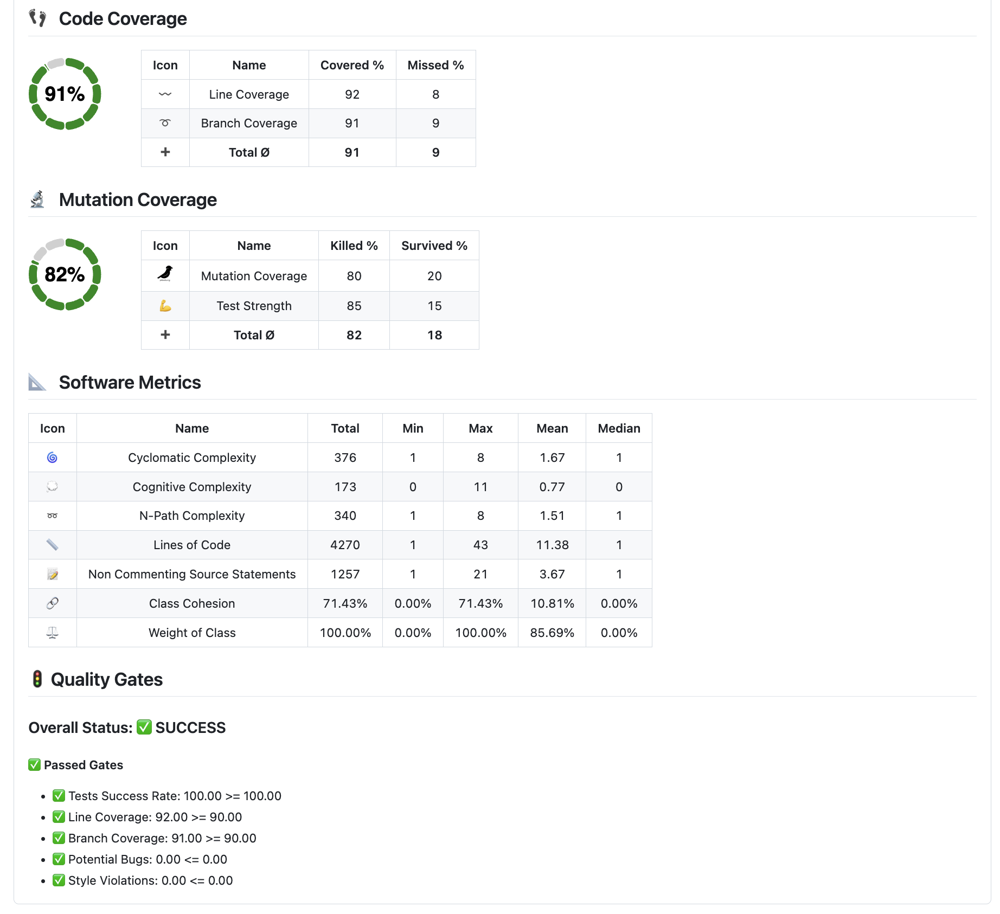

# Quality Monitor GitHub Action 

[](https://github.com/uhafner/quality-monitor/actions/workflows/cd.yml)
[](https://github.com/uhafner/quality-monitor/actions/workflows/codeql.yml)

Automated quality monitoring for GitHub pull requests and branch pipelines. 
The action aggregates test results, code and mutation coverage, static analysis findings, and software metrics, then posts a structured pull request comment and GitHub Checks summary.
When enabled, it also adds inline line comments for warnings, missed or mutated lines.
It is inspired by the Jenkins [Warnings](https://plugins.jenkins.io/warnings-ng/) and [Coverage](https://plugins.jenkins.io/coverage) plugins and works with any language that can produce supported report files. 
A companion for GitLab is available: [Autograding GitLab Action](https://github.com/uhafner/autograding-gitlab-action). If you want to autograde student projects, use the [Autograding GitHub Action](https://github.com/uhafner/autograding-github-action).

Sample Outputs: 
- [Sample Pull Request](https://github.com/uhafner/quality-monitor/pull/103)
- [Checks Output](https://github.com/uhafner/quality-monitor/runs/44526071206)

Workflow Examples:
- Single Step: see [Usage](#usage)
- Multi-Step (recommended for PRs in forks):
  - Part 1: [Build Project Metrics](.github/workflows/quality-monitor-build.yml) · Runs on pull request events in forks with read permissions
  - Part 2: [Comment Quality Results in PR](.github/workflows/quality-monitor-comment.yml) · Runs after part 1 succeeds with write permissions
- Additional: [Create Badges](.github/workflows/update-badges.yml) · Creates and commits badges based on the results of the build step

## Example PR Comment



## Example GitHub Checks Output





## Key Features

- Unified quality summary in PR comment and Checks
- Inline annotations for warnings and missed coverage (optional limits)
- Quality gates (fail or mark unstable based on thresholds)
- Machine\-readable metrics export (`metrics.env`) for badges
- Supports grouped metrics (tests, analysis, coverage, mutation, metrics)

## Supported Reports

- Tests: JUnit, xUnit, NUnit
- Coverage & Mutation: JaCoCo, Cobertura, OpenCover, Open Clover, VectorCAST, Go Coverage, PIT
- Static Analysis: 100\+ formats (see [supported list](https://github.com/jenkinsci/analysis-model/blob/main/SUPPORTED-FORMATS.md))
- Software Metrics: PMD metrics file (cyclomatic, cognitive, NPath, LOC, NCSS, cohesion, weight)

## Prerequisites

The action does **not** run tests or analysis tools. Generate all reports in previous workflow steps, then invoke the action to collect and publish results.

## High-Level Workflow

1. Your build steps create supported XML or JSON reports.
2. The action parses the configured reports (or uses the default config).
3. It generates:
    - GitHub Checks summary
    - Optional PR comment (when pr-number is supplied)
    - Optional source code annotations
    - `metrics.env` for badge generation

## Usage

You can use this action in any GitHub project that uses GitHub Actions. 
The following example shows how to use this action with the default settings in a Java project that uses Maven as a build tool.

```yaml
name: 'Quality Monitor'

on:
  push

jobs:
  monitor-project-quality:
    name: Run the quality monitor
    runs-on: ubuntu-latest
    steps:
      - uses: actions/checkout@v5
      - name: Set up JDK 21
        uses: actions/setup-java@v5
        with:
          distribution: 'temurin'
          java-version: '21'
          check-latest: true
          cache: 'maven'
      - name: Set up Maven
        uses: stCarolas/setup-maven@v5
        with:
          maven-version: 3.9.11
      - name: Build (compile, run tests with coverage & mutation analysis, and static analysis)
        run: mvn -ntp clean verify -Ppit
      - name: Extract pull request number # (commenting on the pull request requires the PR number)
        uses: jwalton/gh-find-current-pr@v1
        id: pr
      - name: Run Quality Monitor
        uses: uhafner/quality-monitor@v3
        with:
          pr-number: ${{ steps.pr.outputs.number }}
          config: >
            {
              "tests": {
                "tools": [
                  {
                    "id": "junit",
                    "name": "Unittests",
                    "pattern": "**/target/*-reports/TEST*.xml"
                  }
                ]
              },
              "coverage": [
                {
                  "name": "JaCoCo",
                  "tools": [
                    {
                      "id": "jacoco",
                      "metric": "line",
                      "sourcePath": "src/main/java",
                      "pattern": "**/jacoco.xml"
                    },
                    {
                      "id": "jacoco",
                      "metric": "branch",
                      "sourcePath": "src/main/java",
                      "pattern": "**/jacoco.xml"
                    }
                  ]
                }
              ]
            } 
          quality-gates: >
            {
              "qualityGates": [
                {
                  "metric": "line",
                  "threshold": 80.0,
                  "criticality": "FAILURE"
                },
                {
                  "metric": "checkstyle",
                  "threshold": 70.0,
                  "criticality": "UNSTABLE"
                }
              ]
            }  
```

## Action Parameters

This action can be configured using the following parameters (see example above). 
Parameters are optional unless marked as required. Omitted parameters fall back to sensible defaults.
- ``config`` (string, JSON): Custom report mapping JSON (tests, coverage, analysis, metrics). If omitted, the built-in [default mapping](https://raw.githubusercontent.com/uhafner/autograding-model/main/src/main/resources/default-no-score-config.json) is used. Provide either inline (multi-line YAML scalar) or load from a file and pass via output. See [the autograding-model](https://github.com/uhafner/autograding-model?tab=readme-ov-file#metric-report-configuration) project for details.
- ``quality-gates`` (string, JSON): Quality gate definitions: `{ "qualityGates": [ { "metric": "<id>", "threshold": <number>, "criticality": "FAILURE|UNSTABLE" } ] }`, see [autograding-model](https://github.com/uhafner/autograding-model?tab=readme-ov-file#quality-gates) project. If omitted, no gates are enforced (the build result stays successful).
- ``checks-name`` (string, default: `Quality Monitor`): Custom name for the GitHub Checks run.
- ``title-metric`` (string enum, default: `line`): Metric shown in the Checks title. Allowed: `line`, `branch`, `instruction`, `mutation`, any static analysis tool id, or `none`.
- ``pr-number`` (number): Pull request number to enable PR comment + inline annotations. Omit on branch builds that are not pull requests.
- ``github-token`` (string, default: `${{ github.token }}`): Token used for API calls and commenting. Override only if you need elevated permissions (e.g. write to another repo).
- ``github-api-url`` (string, rarely needed): Override GitHub API base URL (GitHub Enterprise Server).
- ``skip-annotations`` (boolean, default: `false`): If `true`, suppress creation of per-line coverage and warning annotations.
- ``show-headers`` (boolean, default: `false`): If `true`, section headers are rendered in the Checks summary and PR comment.
- ``comments-strategy`` (enum, default `REMOVE`): Controls PR commenting:
  - ``ADD``: Always add a new comment (history).
  - ``REMOVE``: Remove previous comment, then create a fresh one.
  - ``UPDATE``: Update existing comment (create if missing).
- ``max-warning-annotations`` (number, optional): Upper limit of warning annotations. Omit for unlimited.
- ``max-coverage-annotations`` (number, optional): Upper limit of missed coverage annotations. Omit for unlimited.
- ``sha`` (string): Commit SHA to associate results with (override when analyzing a different revision than `GITHUB_SHA`).


## Pull Request Comments

The action posts a structured quality summary as a PR comment only if you provide the pull request number (`pr-number`). 
Without this input you still get the GitHub Checks output but no PR comment or inline annotations.

### How it works
1. A preceding step determines the current PR number.
2. You pass that number to the action (`pr-number`).
3. The action creates or updates a single canonical comment (default `comments-strategy: REMOVE`).

To disable commenting: omit `pr-number` (e.g. for `push` builds on `main`).  
Forked PRs: Commenting works with the default `${{ github.token }}`; pushing badges or other write operations still requires additional permissions.

### Comment Strategies
Use `comments-strategy` to control behavior:
- `UPDATE`: Edit the existing comment (clean thread).
- `ADD`: Add a new comment on every run (history/audit).
- `REMOVE` (default): Remove prior comment, then add a fresh one (forces top placement).

### Minimal Example

```yaml
- name: Detect pull request
  uses: jwalton/gh-find-current-pr@v1
  id: pr

- name: Run Quality Monitor
  uses: uhafner/quality-monitor@v3
  with:
    pr-number: ${{ steps.pr.outputs.number }}
    comments-strategy: UPDATE
```

## Automatic Badge Creation

[](https://github.com/uhafner/autograding-github-action/actions/workflows/dogfood.yml)
[](https://github.com/uhafner/autograding-github-action/actions/workflows/dogfood.yml)
[](https://github.com/uhafner/autograding-github-action/actions/workflows/dogfood.yml)
[](https://github.com/uhafner/autograding-github-action/actions/workflows/dogfood.yml)
[](https://github.com/uhafner/autograding-github-action/actions/workflows/dogfood.yml)


You can convert the metrics into SVG badges that reflect the current project status.
The action writes its parsed metrics to `metrics.env`. 
This file can be used to create badges using the [GitHub Badge Action](https://github.com/marketplace/actions/badge-action). 
The following snippet shows how to create several badges for your project. The full example is visible in [my autograding workflow](https://raw.githubusercontent.com/uhafner/autograding-github-action/main/.github/workflows/dogfood.yml). 

```yaml
  [...]
  - name: Run Quality Monitor # Creates the file metrics.env
    uses: uhafner/quality-monitor@v3
  - name: Write metrics to GitHub output
    id: metrics
    run: |
      cat metrics.env >> "${GITHUB_OUTPUT}"
      mkdir -p badges
  - name: Generate the badge SVG image for the line coverage
    uses: emibcn/badge-action@v2.0.2
    with:
      label: 'Line coverage'
      status: ${{ steps.metrics.outputs.line }}%
      color: 'green'
      path: badges/line-coverage.svg
  [...]
  - name: Generate the badge SVG image for potential bugs
    uses: emibcn/badge-action@v2.0.2
    with:
      label: 'Potential Bugs'
      status: ${{ steps.metrics.outputs.bugs }}
      color: 'red'
      path: badges/bugs.svg
  - name: Commit updated badges
    continue-on-error: true
    run: |
      git config --local user.email "action@github.com"
      git config --local user.name "GitHub Action"
      git add badges/*.svg
      git commit -m "Update badges with results from latest quality monitor" || true
  - name: Push updated badges to GitHub repository
    uses: ad-m/github-push-action@master
    if: ${{ success() }}
    with:
      branch: main
```
