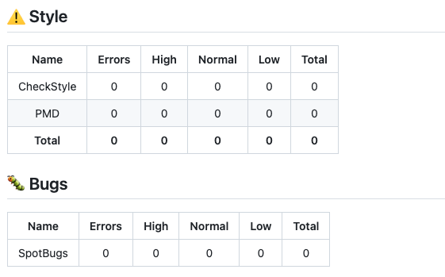

# Quality Monitor GitHub Action 

[](https://github.com/uhafner/quality-monitor/actions/workflows/cd.yml)
[](https://github.com/uhafner/quality-monitor/actions/workflows/codeql.yml)

This GitHub action monitors the quality of projects based on a configurable set of metrics and gives feedback on pull requests (or single commits) in GitHub. This action is a stand-alone version of my Jenkins [Warnings](https://github.com/jenkinsci/warnings-ng-plugin) and [Coverage](https://github.com/jenkinsci/coverage-plugin) plugins. It can be used in any GitHub project that uses GitHub Actions. A [similar action](https://github.com/uhafner/autograding-gitlab-action) is available for GitLab projects as well.

You can see the results of this action in an [example pull request](https://github.com/uhafner/codingstyle/pull/882) and the associated [GitHub Checks output](https://github.com/uhafner/codingstyle/runs/19832187476). 


Please note that the action works on report files that are generated by other tools. It does not run the tests or static analysis tools itself. You need to run these tools in a previous step of your workflow. See the example below for details. This has the advantage that you can use a tooling you are already familiar with. So the action will run for any programming language that can generate the required report files. There are already more than [one hundred analysis formats](https://github.com/jenkinsci/analysis-model/blob/main/SUPPORTED-FORMATS.md) supported. Code and mutation coverage reports can use the JaCoCo, Cobertura, OpenCover and PIT formats, see the [coverage model](https:://github.com/jenkinsci/coverage-model) for details. Test results can be provided in the JUnit, XUnit, or NUnit XML-formats.

# GitHub Checks

The details output of the action is shown in the GitHub Checks tab of the pull request: 


# Howto

You can use this action in any GitHub project that uses GitHub Actions. The following example shows how to use this action with the default settings in a Java project that uses Maven as a build tool.

```yaml
name: 'Quality Monitor'

on:
  push

jobs:
  monitor-project-quality:
    name: Run the quality monitor
    runs-on: ubuntu-latest
    steps:
      - uses: actions/checkout@v4
      - name: Set up JDK 21
        uses: actions/setup-java@v3
        with:
          distribution: 'temurin'
          java-version: '21'
          check-latest: true
          cache: 'maven'
      - name: Set up Maven
        uses: stCarolas/setup-maven@v5
        with:
          maven-version: 3.9.6
      - name: Build # (compile, test with code and mutation coverage, and run static analysis)
        run: mvn -ntp clean verify -Ppit
      - name: Extract pull request number # (commenting on the pull request requires the PR number)
        uses: jwalton/gh-find-current-pr@v1
        id: pr
      - name: Run Quality Monitor
        uses: uhafner/quality-monitor@v1
        with:
          pr-number: ${{ steps.pr.outputs.number }}
```

## Action Parameters

This action can be configured using the following parameters (see example above):
- ``github-token: ${{ secrets.GITHUB_TOKEN }}``: optional parameter: GitHub access token. Defaults to ``${{ github.token}}``.
- ``github-api-url: ${{ github.api_url }}``: optional parameter: GitHub API URL when different that what is given by default. Defaults to ``${{ github.api_url }}``.
- ``config: "{...}"``: optional configuration, see sections above for details, or consult the [autograding-model](https://github.com/uhafner/autograding-model) project for the exact implementation. If not specified, a [default configuration](https://raw.githubusercontent.com/uhafner/autograding-model/main/src/main/resources/default-no-score-config.json) will be used.
- ``pr-number: ${{ steps.pr.outputs.number }}``: optional number of the pull request. If not set, then just the checks will be published but not a pull request comment.
- ``checks-name: "Name of checks"``: optional name of GitHub checks (overwrites the default: "Quality Monitor").
- ``skip-annotations: true``: Optional flag to skip the creation of annotations (for warnings and missed coverage).
- ``max-warning-comments: <number>``: Optional parameter to limit the number of warning comments at specific lines. By default, all line comments are created.
- ``max-coverage-comments: <number>``: Optional parameter to limit the number of coverage comments at specific lines. By default, all line comments are created.

# Metrics Configuration

The individual metrics can be configured by defining an appropriate `config` property (in JSON format) in your GitHub workflow:

```yaml
  [...]
  - name: Run Quality Monitor
    uses: uhafner/quality-monitor@v1
    with:
      pr-number: ${{ steps.pr.outputs.number }}
      config: > # Override default configuration: just evaluate the test results
        {
          "tests": {
            "name": "JUnit",
            "tools": [
              {
                "id": "test",
                "name": "Unittests",
                "pattern": "**/target/*-reports/TEST*.xml"
              }
            ]
        } 
        }
  [...]
```

Currently, you can select from the metrics shown in the following sections. Each metric can be configured individually. All of these configurations are composed in the same way: you can define a list of tools that are used to collect the data, and a name and icon for the metric. All tools need to provide a pattern where the quality monitor can find the result files in the workspace (e.g., JUnit XML reports). Additionally, each tool needs to provide the parser ID of the tool so that the underlying model can find the correct parser to read the results. See [analysis model](https:://github.com/jenkinsci/analysis-model) and [coverage model](https:://github.com/jenkinsci/coverage-model) for the list of supported parsers.

## Test statistics


This metric can be configured using a JSON object `tests`, see the example below for details: 

```json
{
  "tests": {
    "name": "JUnit",
    "tools": [
      {
        "id": "test",
        "name": "Unittests",
        "pattern": "**/junit*.xml"
      }
    ]
  }
}
``` 

Skipped tests will be listed individually. For failed tests, the test error message and stack trace will be shown directly after the summary in the pull request.

## Code or mutation coverage


This metric can be configured using a JSON object `coverage`, see the example below for details:

```json
{
  "coverage": [
    {
      "name": "JaCoCo",
      "tools": [
        {
          "id": "jacoco",
          "name": "Line Coverage",
          "metric": "line",
          "sourcePath": "src/main/java",
          "pattern": "**/jacoco.xml"
        },
        {
          "id": "jacoco",
          "name": "Branch Coverage",
          "metric": "branch",
          "sourcePath": "src/main/java",
          "pattern": "**/jacoco.xml"
        }
      ]
    },
    {
      "name": "PIT",
      "tools": [
        {
          "id": "pit",
          "name": "Mutation Coverage",
          "metric": "mutation",
          "sourcePath": "src/main/java",
          "pattern": "**/mutations.xml"
        }
      ]
    }
  ]
}
```

Missed lines or branches as well as survived mutations will be shown as annotations in the pull request:


## Static analysis



This metric can be configured using a JSON object `analysis`, see the example below for details:

```json
{
  "analysis": [
    {
      "name": "Style",
      "id": "style",
      "tools": [
        {
          "id": "checkstyle",
          "name": "CheckStyle",
          "pattern": "**/target/checkstyle-result.xml"
        },
        {
          "id": "pmd",
          "name": "PMD",
          "pattern": "**/target/pmd.xml"
        }
      ]
    },
    {
      "name": "Bugs",
      "id": "bugs",
      "icon": "bug",
      "tools": [
        {
          "id": "spotbugs",
          "name": "SpotBugs",
          "sourcePath": "src/main/java",
          "pattern": "**/target/spotbugsXml.xml"
        }
      ]
    }
  ]
}
```

All warnings will be shown as annotations in the pull request:


    
## Pull Request Comments

The action writes a summary of the results to the pull request as well. Since the action cannot identify the correct pull request on its own, you need to provide the pull request as an action argument. 

```yaml
  [...]
      - name: Extract pull request number
        uses: jwalton/gh-find-current-pr@v1
        id: pr
      - name: Run Quality Monitor
        uses: uhafner/quality-monitor@v1
        with:
          pr-number: ${{ steps.pr.outputs.number }}
          checks-name: "Quality Monitor GitHub Action"
          config: {...}
  [...]
```

Configuring the action in this way will produce an additional comment of the form:


## Automatic Badge Creation

[](https://github.com/uhafner/autograding-github-action/actions/workflows/dogfood.yml)
[](https://github.com/uhafner/autograding-github-action/actions/workflows/dogfood.yml)
[](https://github.com/uhafner/autograding-github-action/actions/workflows/dogfood.yml)
[](https://github.com/uhafner/autograding-github-action/actions/workflows/dogfood.yml)
[](https://github.com/uhafner/autograding-github-action/actions/workflows/dogfood.yml)


The results of the action can be used to create various badges that show the current status of the project. The action writes the results of the action to a file called `metrics.env` in the workspace. This file can be used to create badges using the [GitHub Badge Action](https://github.com/marketplace/actions/badge-action). The following snippet shows how to create several badges for your project, the full example is visible in [my autograding workflow](https://raw.githubusercontent.com/uhafner/autograding-github-action/main/.github/workflows/dogfood.yml). 

```yaml
  [...]
  - name: Run Quality Monitor
    uses: uhafner/quality-monitor@v1
    with:
      pr-number: ${{ steps.pr.outputs.number }}
  - name: Write metrics to GitHub output
    id: metrics
    run: |
      cat metrics.env >> "${GITHUB_OUTPUT}"
      mkdir -p badges
  - name: Generate the badge SVG image for the line coverage
    uses: emibcn/badge-action@v2.0.2
    with:
      label: 'Line coverage'
      status: ${{ steps.metrics.outputs.line }}%
      color: 'green'
      path: badges/line-coverage.svg
  - name: Generate the badge SVG image for the branch coverage
    uses: emibcn/badge-action@v2.0.2
    with:
      label: 'Branch coverage'
      status: ${{ steps.metrics.outputs.branch }}%
      color: 'green'
      path: badges/branch-coverage.svg
  - name: Generate the badge SVG image for the mutation coverage
    uses: emibcn/badge-action@v2.0.2
    with:
      label: 'Mutation coverage'
      status: ${{ steps.metrics.outputs.mutation }}%
      color: 'green'
      path: badges/mutation-coverage.svg
  - name: Generate the badge SVG image for the style warnings
    uses: emibcn/badge-action@v2.0.2
    with:
      label: 'Style warnings'
      status: ${{ steps.metrics.outputs.style }}
      color: 'orange'
      path: badges/style-warnings.svg
  - name: Generate the badge SVG image for the potential bugs
    uses: emibcn/badge-action@v2.0.2
    with:
      label: 'Potential Bugs'
      status: ${{ steps.metrics.outputs.bugs }}
      color: 'red'
      path: badges/bugs.svg
  - name: Commit updated badges
    continue-on-error: true
    run: |
      git config --local user.email "action@github.com"
      git config --local user.name "GitHub Action"
      git add badges/*.svg
      git commit -m "Update badges with results from latest autograding" || true
  - name: Push updated badges to GitHub repository
    uses: ad-m/github-push-action@master
    if: ${{ success() }}
    with:
      branch: main
```
